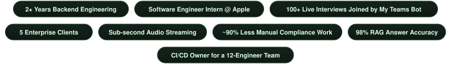

Backend &amp; DevOps engineer with 2+ years shipping production systems at <b>Apple</b> and early-stage startups. 
From <b>event-driven architectures</b> to <b>real-time AI pipelines</b>, I like owning hard problems end to end. 
MSc Computing (DevOps), ATU · researched the carbon cost of CI/CD pipelines.

<b>Open to Backend · Platform · DevOps · SRE · Real-time AI engineering roles.</b>

---

## ⚡ Impact

### &nbsp; Apple · Software Engineer Intern
Mar 2026 – Sep 2026 · Java · Spring Boot · Cassandra · OpenSearch · SNS/SQS

- Built **Scheduled Updates** and **Revert Changeset** across **5 SEO services**, letting business teams schedule SEO metadata changes up to **3 months ahead for 900K+ Apple Store URLs**
- Added checks that stop conflicting SEO edits from corrupting live data, then fixed a Cassandra issue that **unblocked ~100 stuck changesets** and cut resolution time by **~80%**
- Evaluated **OpenSearch vs Apple's managed Solr** on data types, indexing and query performance, then provisioned it across environments with Apple's DB team
- Built changeset content search on OpenSearch with **SNS/SQS replication across a multi-DC deployment**, so business teams search before/after values across hundreds of thousands of records instead of opening each one
- **Led a cross-functional team at Apple's internal GenAI Hackathon** (shortlisted for sponsorship) and started productionising a tool that automates regulatory document ingestion, version diffing and compliance reporting for supply chain teams

<table>
<tr>
<td width="50%" valign="top">

### &nbsp; WebOsmotic · Jr Backend Engineer
Apr 2024 – Jun 2025 · C# · .NET · Azure · Python · RAG

- Built and ran a **Microsoft Teams bot as an Azure multi-tenant service** that joins scheduled interviews on its own, owning uptime and session reliability across concurrent tenants
- Designed a **sub-second WebSocket pipeline** streaming live audio from the C# bot to a Python AI server, with stream health checks and reconnect handling
- Built document ingestion and **RAG questionnaire automation** for narad.io, an AI-powered TPRM platform

</td>
<td width="50%" valign="top">

### &nbsp; WebOsmotic · Software Engineer Intern
Oct 2023 – Mar 2024 · Node.js · MongoDB · REST

- Built the core backend of an internal **intranet platform**: projects, documents and employee admin
- Integrated a **live biometric punch-machine stream** and a timezone-aware shift API that stores everything in UTC, removing multi-timezone data bugs at the source
- Worked directly with the CEO and PM on demos, client feedback and early go-to-market

</td>
</tr>
</table>

---

## 🛰️ Featured systems

<table>
<tr>
<td width="50%" valign="top">

<h3 align="center"><a href="https://github.com/Umer-2612/realtime-meeting-intelligence">Realtime Meeting Intelligence</a></h3>

Bots that join <b>Zoom and Microsoft Teams</b> calls, capture raw audio and video, and stream it to a Python server for <b>live transcription and analysis</b>. Windows and Linux workloads on <b>AWS EKS</b>.

</td>
<td width="50%" valign="top">

<h3 align="center"><a href="https://github.com/Umer-2612/realtime-transcribe">realtime-transcribe</a></h3>

Self-hosted <b>WebSocket speech-to-text</b>. Streams partial and final transcripts, and uses a <b>turn-detection model</b> to decide when a speaker is done, not a fixed silence timeout.

</td>
</tr>
<tr>
<td width="50%" valign="top">

<h3 align="center"><a href="https://github.com/Umer-2612/msc-devops-dissertation">Greening the Pipeline</a></h3>

<i>MSc DevOps research · ATU Donegal</i>

Measures the <b>carbon cost of CI/CD</b> across 5 open-source projects (HTTPie, got, Retrofit, resty, Gson) and compares which pipeline changes cut it most. Full replication package included.

</td>
<td width="50%" valign="top">

<h3 align="center"><a href="https://github.com/Umer-2612/memory-core">memory-core</a></h3>

<i>Long-term memory for AI apps</i>

<b>FastAPI</b> service that stores and retrieves memories with <b>semantic search on pgvector</b>, using free local embeddings. Optional Claude integration.

</td>
</tr>
</table>

<b>More projects</b>

 

| Project | What it is |
|---|---|
| [Restaurant platform (Australia)](https://github.com/Umer-2612/Restaurant-Api) | Backend API with **Stripe** payments and admin controls for a live client restaurant site, on AWS EC2 with health checks and auto-restart |
| Multi-Agent Voice AI Framework | Multi-agent framework for GPT-driven business automation: agent memory, tool use and reasoning loops, with encrypted message queues and anonymised logs |
| [FedSC-Risk](https://github.com/Umer-2612/FedSC-Risk) | Federated learning with **differential privacy** (Flower, Opacus, PyTorch) for supply chain risk prediction |
| [Vernacular Text Interpreter](https://github.com/Umer-2612/Cursor-Hackathon-Dublin) | Cursor Hackathon Dublin: turns Hinglish typed in English letters into Devanagari, meaning, intent and tone |
| [umer-claude-skills](https://github.com/Umer-2612/umer-claude-skills) | My Claude Code skills for code review, git workflow and writing tone |

---

## 🧰 Stack

<table align="center">
<tr>
<td align="center" width="50%"><b>Backend</b>  </td>
<td align="center" width="50%"><b>Cloud &amp; DevOps</b>  </td>
</tr>
<tr>
<td align="center"><b>Data</b>  </td>
<td align="center"><b>AI</b>   
    </td>
</tr>
</table>

---

## 🏆 Recognition

- **Apple GenAI Hackathon**: led a cross-functional team, project shortlisted for sponsorship
- **Employee of the Month** ("The Challenge Seeker") at WebOsmotic, for backend work
- **FusionHack 2024 finalist**: Go API for event management with real-time scheduling
- **300+** problems solved on LeetCode and other platforms · mentored **20+** students for coding interviews

---

## 🎓 Education

- **MSc Computing in DevOps**, Atlantic Technological University, Donegal, Ireland · Sep 2025 – Sep 2026
- **B.Tech Computer Engineering**, Bhagwan Mahavir College of Engineering and Technology, Surat, India · 2021 – 2025 · CGPA 8.48/10

<b>Certifications</b>

 

- **AWS Cloud Quest: Generative AI Practitioner**: Amazon Bedrock and foundation models
- **AWS Fundamentals of Machine Learning and AI**: ML lifecycle, SageMaker, Rekognition, Comprehend
- **AWS Cloud Quest: Cloud Practitioner** and **Cloud Essentials**: compute, storage, networking, IAM
- **MongoDB: Search with MongoDB**: lexical search, BM25 ranking, `$search` indexing
- **MongoDB: AI-Powered Search with Vector Search**: embeddings, vector indexes, retrieval strategies
- **Web Development Bootcamp** by Angela Yu

---

## 📊 GitHub stats

